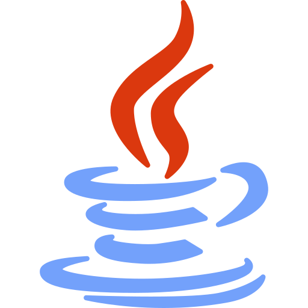
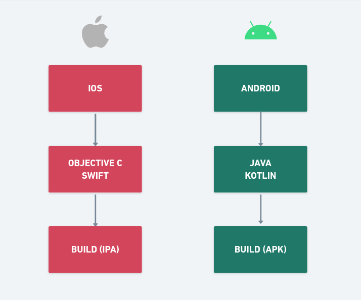
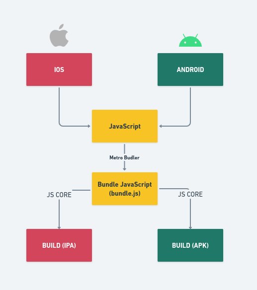

<h3
  align="center"
>
  
  <h3
    align="center"
  >
    Este repósitorio é destinado ao estudo dos fundamentos do React Native de forma sólida e completa dentro do desenvolvimento da aplicação.
  </h3>
</h3>

 

<h3
  align="center"
>
  

    <strong>SUMMARY</strong>
  

  <a
    href="#TECHNOLOGIES"
  >
    TECHNOLOGIES
  </a>
   
  <a
    href="#WHAT-REACT-NATIVE"
  >
    WHAT'S REACT NATIVE?
  </a>
   
  <a
    href="#STYLESHEET"
  >
    STYLESHEET
  </a>
   
  <a
    href="#COMPONENTS"
  >
    COMPONENT'S
  </a>
   
  <a
    href="#Hooks"
  >
    HOOKS
  </a>
   
  <a
    href="#TypeScript"
  >
    TYPESCRIPT
  </a>
   
  <a
    href="#Debug"
  >
    DEBUG
  </a>
   
  <a
    href="#Running"
  >
    RUNNING IN YOUR MACHINE
  </a>
   
</h3>

 

## TECHNOLOGIES

 

<h3
  align="center"
>
  &nbsp;&nbsp;
  &nbsp;&nbsp;
  
</h3>

  As tecnologias que utilizo para o meu setup inicialmente são uma
  <strong
  >
    IDE de desenvolvimento
  </strong>, eu utilizo o
  <a
    href="https://code.visualstudio.com"
  >
    VS Code
  </a>
  , o
  <a
    href="https://nodejs.org/en/"
  >
    Node.js
  </a>
  que é o ambiente de execução
  <a
    href="https://developer.mozilla.org/pt-BR/docs/Web/JavaScript"
  >
    JavaScript
  </a>
  , é utilizado para rodar o JavaScript no servidor, com alta capacidade de escalabilidade e desempenho, e o
  <a
    href="https://yarnpkg.com"
  >
    Yarn
  </a>
  que é um gerenciador de pacotes do
  <strong
  >
    Node.js
  </strong>
    assim como o
  <a
    href="https://www.npmjs.com"
  >
    NPM
  </a>
  .

 

<h3
  align="center"
>
  &nbsp;&nbsp;
  &nbsp;&nbsp;
  
</h3>

 

  Como stack de desenvolvimento inicial com
  <strong
  >
    React Native
  </strong>
  , utilizo o
  <a
    href="https://reactnative.dev"
  >
    React Native CLI
  </a>
  , utilizo como emulador, o
  <a
    href="https://developer.android.com/studio/run/emulator"
  >
    AVD (Android Virtual Device)
  </a>
  do
  <strong
  >
    Android Studio
  </strong>
  , para o
  <a
    href="https://www.java.com/pt-BR/"
  >
    Java
  </a>
  utilizo a versão LTS da
  <a
    href="https://docs.oracle.com/en/java/javase/11/"
  >
    JDK 11 (Java Development Kit)
  </a>

 

## WHAT'S REACT NATIVE?

 

  <strong
  >
    React Native
  </strong>
  é uma estrutura
  <strong
  >
    JavaScript
  </strong>
  para escrever aplicativos móveis de forma nativa para
  <strong
  >
    iOS
  </strong>
  e
  <strong
  >
    Android
  </strong>
  , Projeto Open Sourde mantido pelo
  <a
    href=""
  >
    <strong
    >Facebook</strong>
  </a>
  desde 2015.

 

<h3
  align="center"
>
  
</h3>

 

  No desenvolvimento
  <strong
  >
    mobile tradicional
  </strong>
  , para desenvolver uma aplicação em plataformas diferentes,
  <strong
  >
    Android
  </strong>
  e
  <strong
  >
    IOS
  </strong>
  é preciso utilizar ferramentas e linguagens diferentes que são consolidadas nativas de cada plataforma

 

<h3
  align="center"
>
  
</h3>

 

  No desenvolvimento mobile multiplataforma utilizando
  <a
    href="#"
  >
    React Native
  </a>
  , o desenvolvimento é mais acelerado, já que se trata da mesma tecnologia e a base de código é a mesma, tanto para o IOS quanto para o Android.

 

<h3
  align="center"
>
  
</h3>

 

  Essa base de código é criada na sintaxe JSX (JavaScript XML) que é passada para o blundle.js que ira transformar esse código em nativo.

## STYLESHEET

 

<h3
  align="justify"
>
  
</h3>

 

## COMPONENTS

 

## HOOKS

 

## TYPESCRIPT

 

## DEBUG

 

## RUNNING IN YOUR MACHINE

